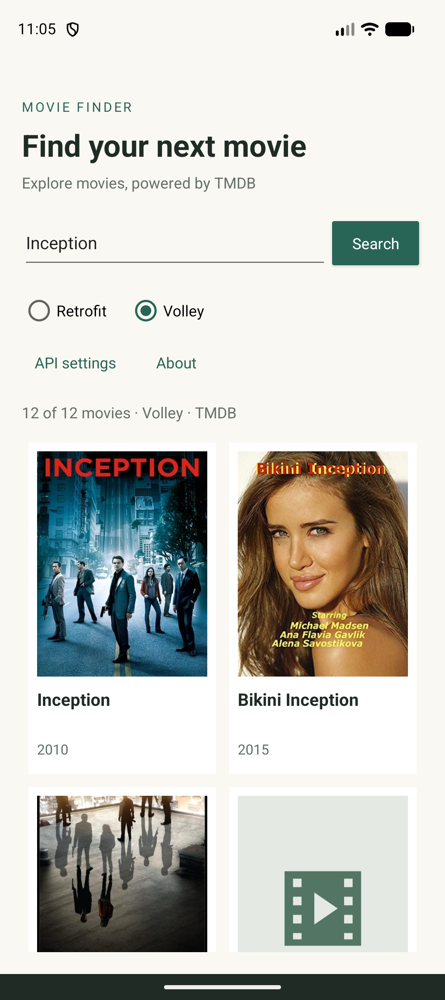
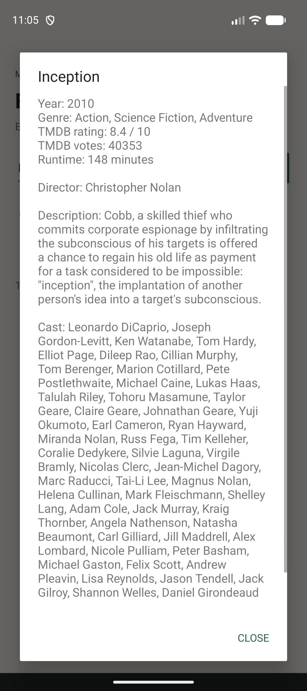
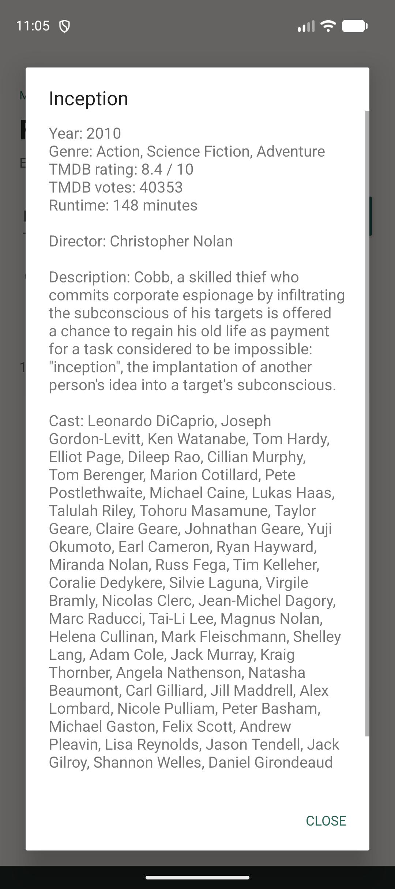
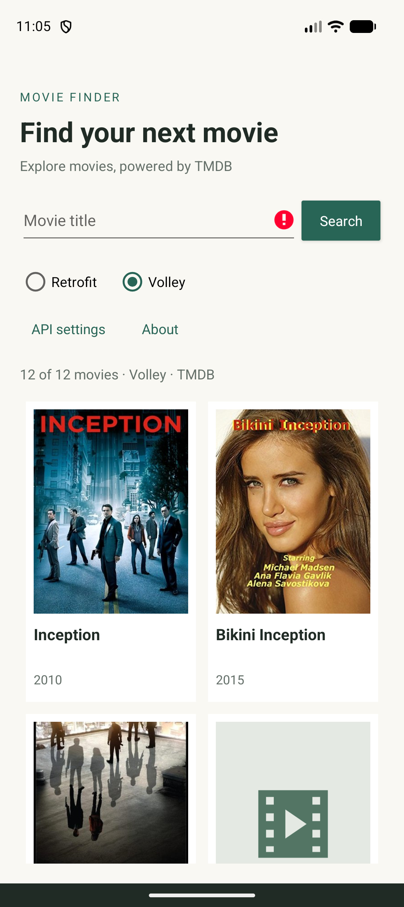
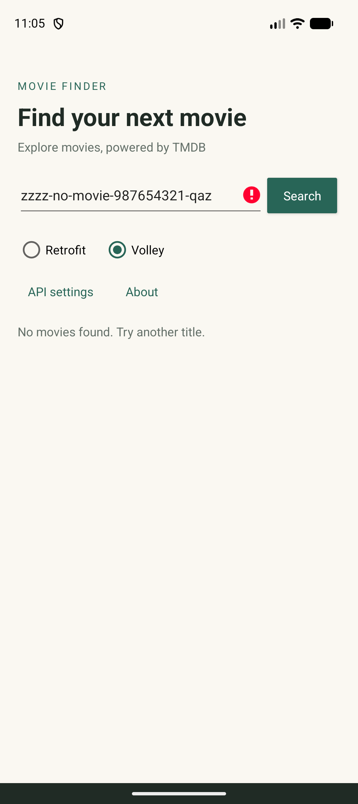
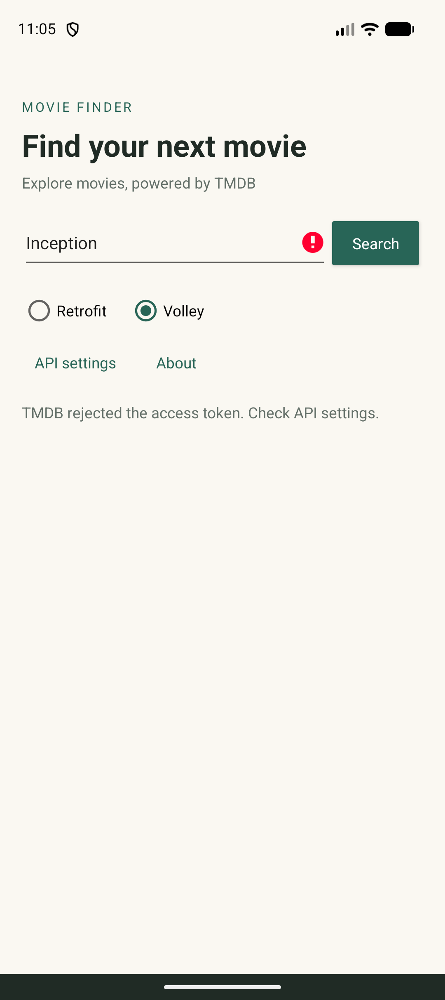
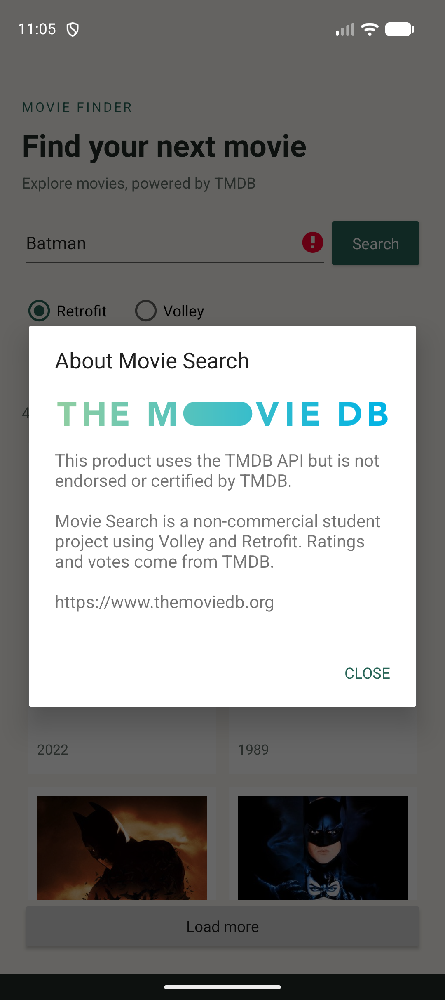

# Demonstration

These screenshots were captured from the running Android app on the Pixel_10 emulator. Version 2.0 connects directly to the live TMDB API over HTTPS. Search results, posters and movie details come from TMDB. No local movie server is involved.

| Retrofit | Volley |
| --- | --- |
|  |  |
|  |  |

The two methods search for Inception, then request its details and credits when the poster is tapped. The same result count and first title are compared by the instrumentation test. Votes and ratings shown in screenshots reflect the API at capture time.

| Empty query | No matches |
| --- | --- |
|  |  |

| Retrofit rejected-token error | Volley rejected-token error |
| --- | --- |
|  |  |

Actual Logcat output is saved in `logcat.txt`. Requests log endpoints and queries without credentials. The project README contains setup commands and the Volley/Retrofit comparison.
